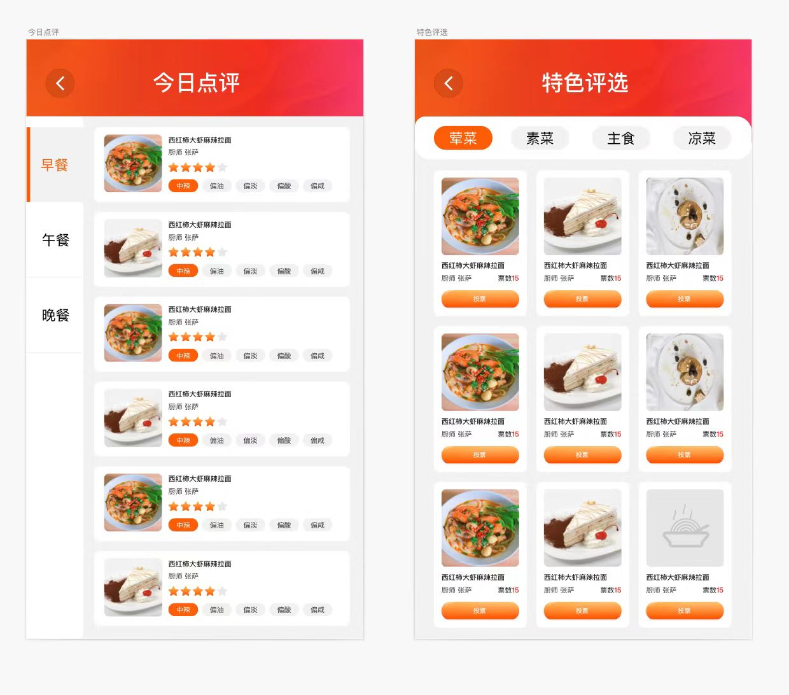
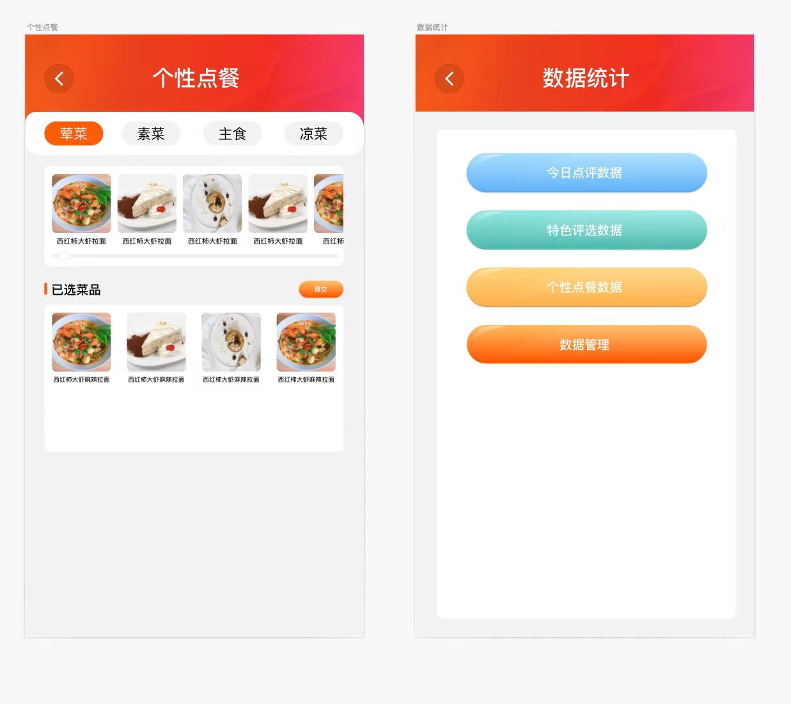
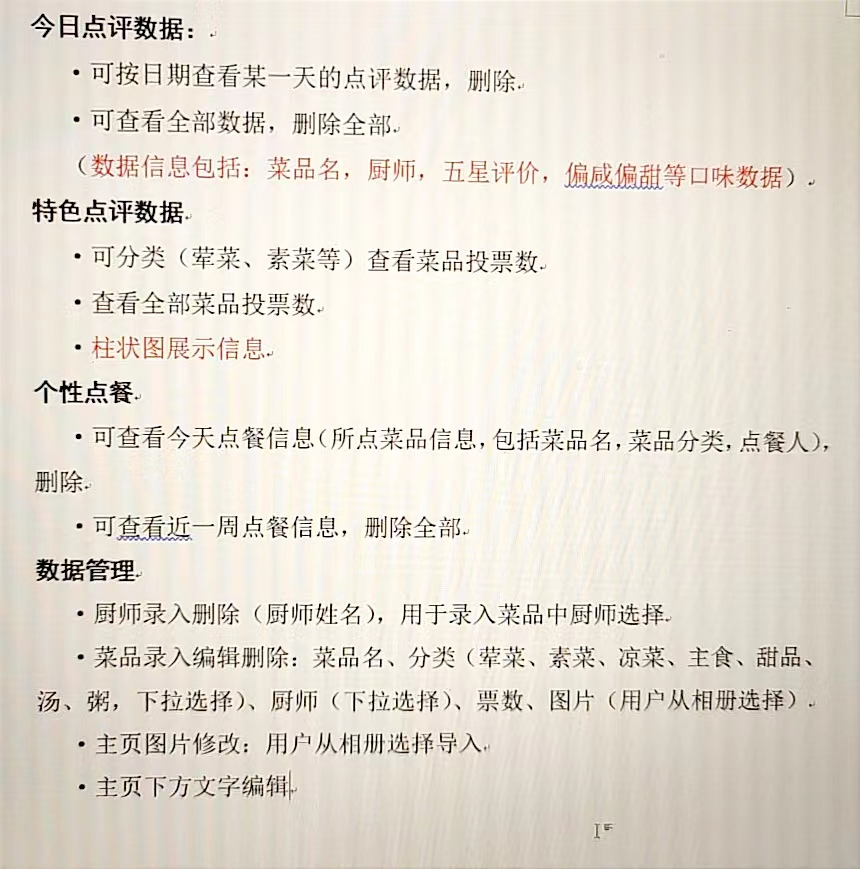
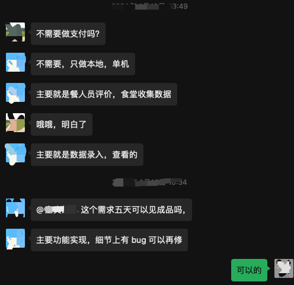

<div align="center"><h1>dianpingApp-点评App</h1></div>
<div align="center"><h3>一款离线的apk应用</h3></div>

<div align="center">

[](https://gitee.com/china-quanda/dianpingApp/stargazers)
[](https://gitee.com/china-quanda/dianpingApp/members)

</div>

## 🎁 项目介绍

基于 uni-app 实现的框架，采用 UniApp、Vue3、Vite、Sqlite、TypeScript、Unocss 代码简洁、易扩展。整合最新技术，离线应用，用于单位食堂，大型食堂就餐人员评价，食堂收集数据。

```
超高人气的框架(uni-app)配合高性能超简单的数据库(Sqlite)加持，阅历痛点，相见恨晚！让 app 开发更简单，更通用，更流行！
```

## 📙 开发流程

```bash
# 1、克隆项目
git clone git@gitee.com:china-quanda/dianpingApp.git

# 2、安装依赖
pnpm install

# 3、运行项目
使用HBuilderX工具 运行到app

# 欢迎你的PR！ 交流微信号：China-Quanda

```

## 🍎 效果截图

<table>
    <tr>
        <td></td>
        <td></td>
    </tr>
    <tr>
        <td></td>
        <td></td>
    </tr>
</table>

## 🍖 功能

1.  今日点评：今日点评数据 1、可按日期查看某一天的点评数据，删除; 2、可查看全部数据，删除全部(数据信息包括:菜品名,厨师,五星评价,偏咸偏甜等口味数据)。
2.  特色评选：特色点评数据 1、可分类(菜、素菜等)查看菜品投票数; 2、查看全部菜品投票数；3、柱状图展示信息。
3.  个性点餐：1、可查看今天点餐信息(所点菜品信息,包括菜品名,菜品分类,点餐人),删除; 2、可查看近一周点餐信息，删除全部。
4.  数据管理：1、厨师录入删除(厨师姓名),用于录入菜品中厨师选择；2、菜品录入编辑删除:菜品名、分类(菜、素菜、凉菜、主食、甜品、汤、粥,下拉选择)、厨师(下拉选择)、票数、图片(用户从相册选择)；3、主页图片修改:用户从相册选择导入；4、主页下方文字编辑。

## 需求描述



## 🎀 捐赠支持

```
如果对您有帮助，请点击右上角⭐Star关注或扫码捐赠，感谢支持开源！
```


## 💐 特别鸣谢

- 👉 UniApp：[https://uniapp.dcloud.net.cn](https://uniapp.dcloud.net.cn)
- 👉 Vue：[https://cn.vuejs.org](https://cn.vuejs.org)
- 👉 Sqlite：[https://www.sqlite.org](https://www.sqlite.org)
- 👉 Unocss：[https://unocss.dev](https://unocss.dev)
- 👉 Vite：[https://vitejs.dev/](https://vitejs.dev/)
- 👉 TypeScript：[https://www.tslang.cn/](https://www.tslang.cn/)
